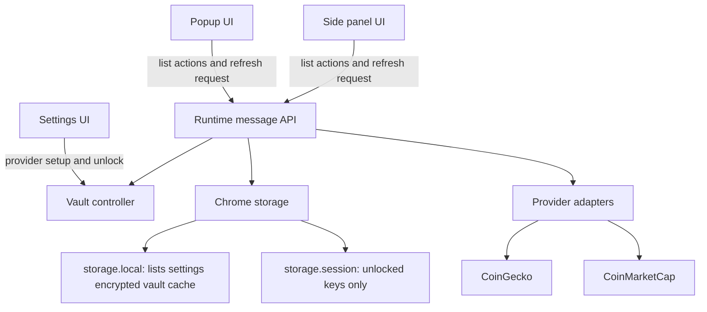

# Orbit Watchlist build roadmap

Date: 2026-08-15  
Status: roadmap complete, MVP build present in `dist`

## 1. Product contract

Orbit Watchlist is a private Chrome companion for quick crypto price checks.

The first release must let a user:

- choose CoinGecko or CoinMarketCap;
- enter a provider key without exposing it in logs, messages, sync, or UI state after entry;
- create, rename, delete, and switch between custom watchlists;
- add assets by provider ID, name, or symbol;
- review and resolve ambiguous symbols before import;
- paste many assets at once and see a result for every line;
- reorder assets by drag and drop;
- sort by saved order, name, price, market cap, or 24-hour change;
- see price, market cap, 24-hour change, provider, exact update time, stale state, and last successful refresh;
- use the popup for a quick check and the side panel for full list management;
- refresh only while a popup or side panel is open.

The first release does not include alerts, notifications, charts, portfolio balances, news, page overlays, analytics, accounts, or cloud sync.

## 2. Current state

The workspace has the initial MV3 shell:

- React, TypeScript, Vite, Tailwind, and ReUI configuration;
- popup and side panel HTML entry points;
- a Manifest V3 file with `storage` and `sidePanel` permissions;
- optional host permissions for the three provider API origins;
- initial dark graphite and mint visual tokens.

The planned MVP is present in the workspace:

- installed package dependencies and lockfile;
- popup and side panel entry points;
- shared types and local storage schema;
- encrypted key vault with session unlock;
- provider adapters and service worker messages;
- watchlist, import, sorting, stale, and permission UI;
- provider fixtures and unit tests;
- privacy page, store copy, and manual QA checklist;
- verified production build in `dist`.

The remaining release work is live Chrome QA with real provider keys, a real support URL, and Web Store submission assets.

## 3. Target architecture



### Contexts

`popup.html` and `sidepanel.html` load the same shared React application with different view modes. They share storage and message contracts, but each has its own mounted refresh lifecycle.

`background.ts` is the service worker. It handles side panel opening, provider fetches, permission checks, cache deduplication, and safe runtime messages. It never starts a timer or fetches without a request from an open UI.

The provider adapters run behind one interface. UI code receives normalized quotes and typed errors, not provider response shapes or API keys.

### Suggested source layout

```text
src/
  background.ts
  types.ts
  app/
    App.tsx
    app-state.ts
    view-mode.ts
  components/
    ui/
    watchlist/
    settings/
    import/
    feedback/
  lib/
    chrome-runtime.ts
    storage.ts
    schema.ts
    vault.ts
    permissions.ts
    refresh.ts
    import.ts
    sorting.ts
    formatters.ts
    providers/
      types.ts
      registry.ts
      coingecko.ts
      coinmarketcap.ts
  styles.css
tests/
  vault.test.ts
  import.test.ts
  sorting.test.ts
  providers.test.ts
  storage.test.ts
  runtime.test.ts
  ui.test.tsx
```

## 4. Data model

Use versioned records so future schema changes can migrate safely.

```ts
type ProviderId = "coingecko" | "coinmarketcap";
type CoinGeckoTier = "demo" | "pro";

type AssetRef = {
  provider: ProviderId;
  id: string;
  name: string;
  symbol: string;
  addedAt: string;
};

type Watchlist = {
  id: string;
  name: string;
  provider: ProviderId;
  assets: AssetRef[];
  sort: "saved" | "name" | "price" | "marketCap" | "change24h";
  createdAt: string;
  updatedAt: string;
};

type MarketQuote = {
  provider: ProviderId;
  id: string;
  name: string;
  symbol: string;
  priceUsd: number;
  marketCapUsd?: number;
  change24h?: number;
  updatedAt: string;
  isStale: boolean;
};

type QuoteSnapshot = {
  provider: ProviderId;
  listId: string;
  quotes: MarketQuote[];
  fetchedAt: string;
  lastSuccessfulRefreshAt?: string;
  error?: RefreshError;
};
```

A watchlist owns one provider. Do not mix CoinGecko IDs with CoinMarketCap IDs. To move a list to another provider, create a new provider list and resolve each asset again.

Store normal settings, watchlists, and quote snapshots in `chrome.storage.local`. Store only the encrypted vault envelope in local storage. Store unlocked provider keys in `chrome.storage.session` and clear them on reset or lock.

## 5. Key vault and privacy design

### Remember mode

Remember mode is off by default.

When it is off, a provider key is held only in `chrome.storage.session` after the user enters it. When it is on, the key is encrypted before it is written to local storage. The passphrase is never stored.

Use Web Crypto:

1. Generate a random 16-byte salt.
2. Derive an AES-256-GCM key with PBKDF2-HMAC-SHA-256 and 600,000 iterations.
3. Generate a random 12-byte IV for each vault write.
4. Encrypt a small JSON object containing provider keys and provider mode.
5. Store only version, KDF settings, salt, IV, and ciphertext.
6. Put the decrypted keys in `chrome.storage.session` only after a correct unlock.

The vault API should expose `saveKey`, `unlock`, `lock`, `reset`, and `hasRememberedVault`. It must never expose a read-all-keys function to React components. Provider fetch code asks the vault controller for an internal key only inside the service worker.

Wrong passphrases must return a generic unlock error and leave the existing vault unchanged. Reset must require confirmation, delete the encrypted vault and session keys, and return the user to provider setup.

### Disclosure and permissions

Before the first key save, show a short disclosure:

- the key is supplied by the user;
- it is used only for the selected provider;
- it is kept local to the extension;
- remember mode encrypts it with the user passphrase;
- losing the passphrase requires a vault reset;
- the extension sends requests only to the selected provider API.

Ask for the narrow provider origin permission only when the user connects that provider. Explain the origin in the same screen. Do not request all provider origins at install time.

The privacy policy must state that the extension does not collect browsing history, page content, account data, analytics, advertising data, or usage events. It must list every permission and explain why `storage`, `sidePanel`, and optional provider origins are needed.

## 6. Provider layer

Define one adapter contract:

```ts
interface ProviderAdapter {
  id: ProviderId;
  getAuthModes(): AuthMode[];
  resolveAssets(input: string): Promise<ResolutionResult>;
  getQuotes(ids: string[]): Promise<MarketQuote[]>;
  validateKey(): Promise<void>;
  getRefreshPolicy(): RefreshPolicy;
  getOrigin(): string;
}
```

### CoinGecko

- Demo base: `https://api.coingecko.com/api/v3`.
- Pro base: `https://pro-api.coingecko.com/api/v3`.
- Resolve names and symbols with `/search`.
- Fetch prices with `/simple/price`.
- Request USD price, market cap, 24-hour change, and last updated time.
- Send the correct provider key header for the selected Demo or Pro mode.
- Use a conservative 60-second UI refresh for Demo.
- Keep the Pro refresh interval in a provider policy constant so it can change without changing UI code.

### CoinMarketCap

- Base: `https://pro-api.coinmarketcap.com`.
- Resolve symbols and IDs with `/v1/cryptocurrency/map`.
- Fetch prices with the current `/v3/cryptocurrency/quotes/latest` response shape.
- Use the `X-CMC_PRO_API_KEY` header.
- Use a 60-second refresh window because the endpoint documents a 60-second cache period.

### Common error handling

Map provider responses to these UI-safe errors:

- `missing-key`: connect the provider;
- `locked-key`: unlock the remembered vault;
- `permission-denied`: grant the selected provider origin;
- `invalid-key`: check the key and provider mode;
- `rate-limited`: wait for the next refresh window;
- `offline`: use cached quotes if available;
- `provider-error`: retry later;
- `asset-not-found`: resolve the asset again.

Never display request headers, raw response bodies, or keys in error text.

## 7. Refresh and cache behavior

The UI requests quotes on mount, on manual refresh, and on a visible refresh timer. The timer is created only while the popup or side panel is open and is cleared on unmount or hidden state.

The service worker has no alarm, interval, or startup fetch. It handles a request, checks the quote snapshot and provider refresh policy, and fetches only when the snapshot is outside its refresh window. Manual refresh cannot bypass the provider window.

When a fetch fails:

- keep the last successful quotes;
- set `isStale` to true;
- show the provider error state;
- show the exact last successful refresh time;
- allow a manual retry when the provider window permits it.

When a coin has no cached quote, show an unavailable row instead of a false zero value.

Use stable sorting. Missing market cap or change values go last. Ties fall back to saved order.

## 8. Product screens

### Popup

Purpose: answer “what changed?” in a few seconds.

Include:

- Orbit brand mark and active list name;
- provider badge and last refresh label;
- compact list rows with symbol, price, 24-hour change, and stale badge;
- list switcher;
- refresh button with disabled and loading states;
- clear “Open side panel” button;
- settings link.

The popup must not contain full list editing, bulk import, or long settings forms.

### Side panel

Purpose: manage the full watchlist without leaving the current page.

Include:

- list switcher with create, rename, and delete actions;
- provider and list identity shown near the title;
- sortable asset rows with drag handle;
- saved-order and metric sort control;
- add asset autocomplete;
- bulk paste import dialog;
- empty, loading, stale, offline, invalid-key, permission, and rate-limit states;
- settings drawer or route;
- privacy and reset links.

The side panel opens only from the explicit popup button or another clear user gesture. It does not open on page load.

### Settings

Sections:

1. Provider selection and connection status.
2. CoinGecko Demo or Pro mode when CoinGecko is selected.
3. Key input with show or hide control and a save action.
4. Remember mode with the disclosure beside it.
5. Unlock and lock actions.
6. Provider permission status and request action.
7. Vault reset with a destructive confirmation.
8. Privacy policy and support links.

Use uncontrolled key inputs where practical. Clear the input after save, failure, or navigation. Never put the key in a global React store.

## 9. Import and asset resolution

The import pipeline is separate from quote fetching:

1. Split pasted text by line and comma.
2. Trim whitespace and discard blank entries.
3. Mark exact duplicate inputs and duplicate resolved IDs.
4. Treat a provider ID as an exact candidate when supported.
5. Search names and symbols through the selected provider.
6. Return one result per input with `confirmed`, `ambiguous`, `not-found`, `duplicate`, or `error` status.
7. Require the user to choose a candidate for every ambiguous result.
8. Add only confirmed, non-duplicate assets after the user clicks Import.

The autocomplete and bulk dialog use the same resolution service. This prevents symbol matching from behaving differently in the two screens.

## 10. Build phases

### Phase 0: repair the build path

Work:

- verify the configured Node executable;
- repair or replace the failing `npm` or `pnpm` command;
- install dependencies from `package.json`;
- add the four selected ReUI components;
- create the lockfile.

Exit gate: dependency install completes, `npm run typecheck` can start, and the ReUI imports resolve.

### Phase 1: foundation and contracts

Work:

- add shared provider, list, quote, error, and storage types;
- add storage keys and schema version;
- add schema validation and default settings;
- add runtime message names and typed request or response helpers;
- add the service worker entry and side panel open handler;
- add a small app shell for popup and side panel modes.

Exit gate: both HTML entry points build, the popup button opens the side panel, and a fresh install shows the first-run state.

### Phase 2: vault and setup

Work:

- build Web Crypto vault functions;
- add session key storage and lock behavior;
- add remembered vault envelope;
- add first-run disclosure and consent;
- add permission request flow;
- add reset flow and safe error mapping.

Exit gate: keys never appear in runtime message payloads, local storage contains ciphertext only, wrong passphrases fail without mutation, and reset removes local and session secrets.

### Phase 3: provider adapters

Work:

- implement CoinGecko Demo and Pro auth modes;
- implement CoinMarketCap auth;
- implement resolution for names, IDs, and symbols;
- implement normalized quote fetching;
- classify HTTP, provider, offline, and quota errors;
- add request and response fixtures with secrets removed.

Exit gate: both providers produce the same `MarketQuote` shape and can return cached data with a stale state after a mocked failure.

### Phase 4: shared watchlist state

Work:

- add list creation, rename, deletion, and active-list selection;
- bind each list to one provider;
- add asset add, remove, reorder, and dedupe operations;
- add sort state and stable sorting;
- add quote snapshots and refresh coordinator;
- add local migration version 1.

Exit gate: popup and side panel show the same lists and changes after either view edits storage.

### Phase 5: side panel management UI

Work:

- build list switcher;
- build sortable asset rows;
- add autocomplete;
- add bulk import with per-line statuses;
- add settings screens;
- add all feedback states and retry actions.

Exit gate: a user can create a list, add assets, resolve ambiguity, reorder, sort, refresh, and delete the list without leaving the side panel.

### Phase 6: popup quick view

Work:

- build compact quote rows;
- add list switcher and refresh action;
- show provider, update time, and stale state;
- add the side panel button;
- keep popup loading and error states compact.

Exit gate: the popup is useful on its own and shares data with the side panel without exposing settings complexity.

### Phase 7: security, accessibility, and visual polish

Work:

- check keyboard navigation and visible focus;
- add labels and status announcements for refresh and import results;
- respect `prefers-reduced-motion`;
- verify readable contrast for positive, negative, stale, and error states;
- remove secret values from logs, error boundaries, and DOM after save;
- add manifest and privacy copy;
- check that no content scripts, analytics, or extra permissions were added.

Exit gate: the build passes a manual keyboard pass, the permission list matches the privacy policy, and a source scan finds no key logging.

### Phase 8: release verification

Work:

- run typecheck, unit tests, component tests, and production build;
- load the built extension as unpacked in Chrome;
- test fresh install and upgrade from the prior schema;
- test both providers with valid, invalid, missing, and rate-limited responses;
- test offline behavior with cached and uncached lists;
- inspect the final manifest and permission prompts;
- prepare store description, screenshots, privacy policy URL, and support URL.

Exit gate: every acceptance test in Section 11 passes and the unpacked build loads without console errors.

## 11. Test plan

### Unit tests

- PBKDF2 and AES-GCM round trip;
- wrong passphrase failure;
- new salt and IV on each vault write;
- reset removes vault data;
- import trimming, duplicates, invalid inputs, and ambiguity;
- stable sorting with missing metrics;
- provider response normalization;
- refresh window decisions;
- schema defaults and migration.

### Integration tests

- runtime request with no key;
- runtime request with locked key;
- runtime request with a session key;
- provider permission request and denial;
- cached quote fallback after network failure;
- no provider fetch after popup or side panel unmount;
- shared list changes across popup and side panel stores.

### UI tests

- first-run disclosure;
- provider setup;
- unlock and reset;
- list create, rename, delete, and switch;
- drag reorder and metric sort;
- autocomplete selection;
- bulk import confirmation;
- stale, offline, invalid-key, permission, and rate-limit messages;
- keyboard and reduced-motion behavior.

### Manual Chrome checks

- toolbar icon opens popup;
- popup button opens side panel in the current window;
- side panel does not open on its own;
- optional permissions appear only when requested;
- browser restart clears session keys but leaves only the encrypted vault when remember mode is on;
- uninstall removes extension storage;
- no API calls happen while both UI surfaces are closed.

## 12. Release gates

Do not publish until all gates pass:

- `npm run typecheck` passes;
- `npm test` passes;
- `npm run build` produces a loadable MV3 package;
- no raw key is written to local storage;
- no raw key is returned in runtime messages;
- no API fetch occurs without an open UI request;
- all provider calls use the selected provider and list identity;
- ambiguous symbols require a user choice;
- stale data is labeled with its last successful refresh time;
- permissions and privacy policy match the actual manifest;
- the first-run disclosure appears before the first key is handled.

## 13. First build sequence when work resumes

1. Load `dist` as an unpacked extension in a test Chrome profile.
2. Run the manual QA checklist with a real provider key.
3. Replace the support placeholder in the local privacy page.
4. Capture store screenshots and confirm the final listing text.
5. Submit only after Chrome permissions, privacy, and data handling review passes.
